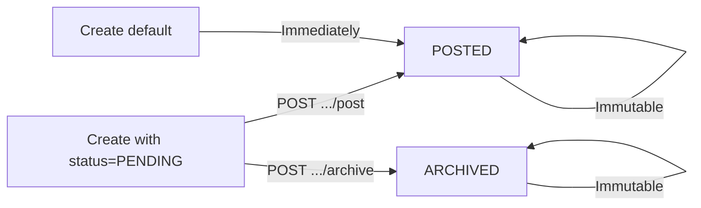
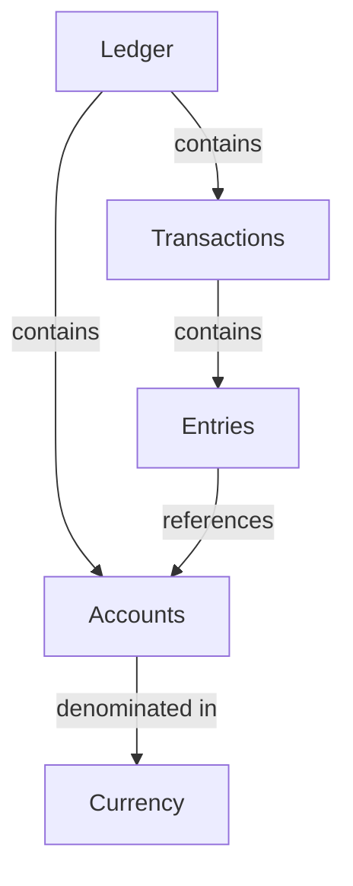

## Overview

The Transfa API is built around five core entities that work together to provide complete double-entry bookkeeping:

1. **Ledgers** - Accounting books that contain accounts
2. **Accounts** - Individual accounts with balances
3. **Transactions** - Financial transactions with multiple entries
4. **Entries** - Individual debit and credit entries
5. **Currencies** - Currency definitions for accounts

## Ledgers

A ledger is a container for accounts and transactions, similar to an accounting book. Organizations typically create separate ledgers for different purposes or business units.

### Key Properties

- **ID**: Unique identifier (UUIDv7)
- **Name**: Human-readable name
- **Description**: Optional description
- **Metadata**: Custom key-value pairs
- **Created/Updated**: Timestamps

### Use Cases

<CardGroup cols={2}>
  <Card title="Multi-Tenant Systems" icon="users">
    Create separate ledgers for each customer
  </Card>
  <Card title="Business Units" icon="building">
    Separate ledgers for different departments
  </Card>
  <Card title="Testing" icon="flask">
    Isolated ledgers for test data
  </Card>
  <Card title="Historical Records" icon="calendar">
    Archive old ledgers while starting fresh
  </Card>
</CardGroup>

### Example

```json
{
  "id": "01933eb1-5fc4-7c85-9c7e-12a34b56c789",
  "name": "Customer ABC Ledger",
  "description": "Main ledger for customer ABC",
  "metadata": {
    "customerId": "cust_456",
    "region": "us-east"
  },
  "createdAt": "2025-10-20T10:00:00Z",
  "updatedAt": "2025-10-20T10:00:00Z"
}
```

## Accounts

Accounts represent individual line items within a ledger. Each account tracks a balance in a specific currency and has a normal balance type (debit or credit).

### Key Properties

- **ID**: Unique identifier (UUIDv7)
- **Ledger ID**: Parent ledger reference
- **Currency**: Three-letter currency code (e.g., USD, EUR)
- **Normal Balance**: Either `debit` or `credit`
- **Balances**: Object containing pending, posted, and available balances
- **Name**: Account name
- **External ID**: Optional external system reference
- **Metadata**: Custom key-value pairs

### Normal Balance Types

<CodeGroup>
```json Debit Accounts
{
  "normalBalance": "debit",
  "examples": [
    "Assets (cash, inventory, equipment)",
    "Expenses (rent, salaries, utilities)"
  ]
}
```

```json Credit Accounts
{
  "normalBalance": "credit",
  "examples": [
    "Liabilities (loans, accounts payable)",
    "Revenue (sales, interest income)",
    "Equity (capital, retained earnings)"
  ]
}
```
</CodeGroup>

### Balance Representation

Each account has a `balances` object containing three types of balances:

**1. Pending Balance**
- Only includes pending (unposted) transactions
- Shows the net amount of transactions awaiting confirmation
- For debit accounts: pending debits - pending credits
- For credit accounts: pending credits - pending debits

**2. Posted Balance**
- Only includes posted (finalized) transactions
- Represents the confirmed balance
- For debit accounts: posted debits - posted credits
- For credit accounts: posted credits - posted debits

**3. Available Balance**
- The spendable or usable balance
- For debit accounts: posted debits - (posted credits + pending credits)
- For credit accounts: posted credits - (posted debits + pending debits)
- Reflects how much can actually be used considering both posted amounts and pending reductions

Each balance contains:
- `credits`: Total credit amount
- `debits`: Total debit amount
- `amount`: Net amount (debits - credits for debit accounts, credits - debits for credit accounts)
- `currency`: Currency code (e.g., USD, EUR)
- `currencyExponent`: Number of decimal places (0-30)

All amounts are decimal numbers with precision determined by the currency exponent:
- **USD** (exponent: 2): $10.50 stored as 10.50
- **EUR** (exponent: 2): €25.99 stored as 25.99
- **JPY** (exponent: 0): ¥100 stored as 100
- **BTC** (exponent: 8): 0.00100000 BTC stored as 0.00100000

### Example

```json
{
  "id": "01933eb2-a1c5-7d42-8f3a-9b87c6d5e4f3",
  "ledgerId": "01933eb1-5fc4-7c85-9c7e-12a34b56c789",
  "name": "Cash - Operating Account",
  "description": null,
  "normalBalance": "DEBIT",
  "externalId": "bank_acc_456",
  "maxBalanceLimit": null,
  "minBalanceLimit": null,
  "balances": {
    "pendingBalance": {
      "credits": 0,
      "debits": 1000.00,
      "amount": 1000.00,
      "currency": "USD",
      "currencyExponent": 2
    },
    "postedBalance": {
      "credits": 0,
      "debits": 1000.00,
      "amount": 1000.00,
      "currency": "USD",
      "currencyExponent": 2
    },
    "availableBalance": {
      "credits": 0,
      "debits": 1000.00,
      "amount": 1000.00,
      "currency": "USD",
      "currencyExponent": 2
    }
  },
  "metadata": {
    "bankName": "Example Bank",
    "accountType": "checking"
  },
  "createdAt": "2025-10-20T10:00:00Z",
  "updatedAt": "2025-10-20T10:00:00Z"
}
```

## Transactions

Transactions represent financial events that affect multiple accounts. Every transaction follows double-entry bookkeeping principles: total debits must equal total credits.

### Key Properties

- **ID**: Unique identifier (UUIDv7)
- **Ledger ID**: Parent ledger reference
- **Status**: `pending`, `posted`, or `archived`
- **Description**: Transaction description
- **Posted At**: When the transaction was posted
- **External ID**: Optional external system reference
- **Metadata**: Custom key-value pairs
- **Entries**: Array of debit and credit entries

### Transaction Lifecycle

Transactions are **created in `POSTED` status by default** and immediately affect account balances. Optionally, you can create transactions with `"status": "PENDING"` for review before posting.



**Status Types:**

1. **Posted** (default): Transaction is finalized and immediately affects account balances
2. **Pending** (optional): Transaction created but not yet finalized - useful for review workflows
3. **Archived**: Pending transaction cancelled (does not affect balances)

<Note>
Only `PENDING` transactions can be posted or archived. Once `POSTED` or `ARCHIVED`, transactions become immutable.
</Note>

### Entries Structure

Each transaction contains one or more entries:

```json
{
  "entries": [
    {
      "accountId": "01933eb2-a1c5-7d42-8f3a-9b87c6d5e4f3",
      "amount": 500.00,
      "direction": "debit",
      "description": "Payment received"
    },
    {
      "accountId": "01933eb2-b7d8-7f53-9a2e-7c8d9e0f1a2b",
      "amount": 500.00,
      "direction": "credit",
      "description": "Revenue recorded"
    }
  ]
}
```

### Example Transaction

```json
{
  "id": "01933eb3-c2f4-7a91-b5c8-3d4e5f6a7b8c",
  "ledgerId": "01933eb1-5fc4-7c85-9c7e-12a34b56c789",
  "status": "POSTED",
  "description": "Customer payment received",
  "postedAt": "2025-10-20T10:30:00Z",
  "externalId": "payment_789",
  "metadata": {
    "paymentMethod": "bank_transfer",
    "customerId": "cust_456"
  },
  "entries": [
    {
      "id": "01933eb3-d5a7-7b82-a9f4-8e9f0a1b2c3d",
      "accountId": "01933eb2-a1c5-7d42-8f3a-9b87c6d5e4f3",
      "amount": 500.00,
      "direction": "debit"
    },
    {
      "id": "01933eb3-e8c9-7d73-b2e5-9f0a1b2c3d4e",
      "accountId": "01933eb2-b7d8-7f53-9a2e-7c8d9e0f1a2b",
      "amount": 500.00,
      "direction": "credit"
    }
  ],
  "createdAt": "2025-10-20T10:30:00Z"
}
```

## Entries

Entries are the individual debit or credit lines within a transaction. They are created automatically when transactions are created and cannot be modified independently.

### Key Properties

- **ID**: Unique identifier (UUIDv7)
- **Transaction ID**: Parent transaction reference
- **Account ID**: Associated account
- **Amount**: Entry amount as a decimal number
- **Direction**: Either `debit` or `credit`
- **Description**: Optional entry description
- **Created At**: Timestamp

### Querying Entries

Entries can be filtered by:
- Ledger ID
- Transaction ID (internal or external)
- Account ID (internal or external)
- Direction (debit or credit)

This enables powerful reporting and reconciliation:

```bash
# Get all debits for a specific account
GET /v1/ledger_entries?accountId=acc_123&direction=debit

# Get all entries for a transaction
GET /v1/ledger_entries?transactionId=txn_456
```

## Currencies

Currencies define the monetary units used by accounts. Each account must specify a currency, and all transactions must balance within the same currency.

### Key Properties

- **Code**: Three-letter ISO 4217 code (e.g., USD, EUR, GBP)
- **Name**: Currency name
- **Scale**: Number of decimal places (e.g., 2 for USD = cents)

### Supported Currency Types

- **Fiat Currencies**: USD, EUR, GBP, JPY, etc.
- **Cryptocurrencies**: BTC, ETH, USDC, etc.
- **Custom Currencies**: Loyalty points, credits, tokens

### Example

```json
{
  "code": "USD",
  "name": "United States Dollar",
  "scale": 2
}
```

### Currency Scale

The scale determines the number of decimal places for amounts:

| Currency | Scale | Example Amount | Display |
|----------|-------|----------------|---------|
| USD | 2 | 10.50 | $10.50 |
| JPY | 0 | 100 | ¥100 |
| BTC | 8 | 0.00100000 | 0.001 BTC |

## Relationships



